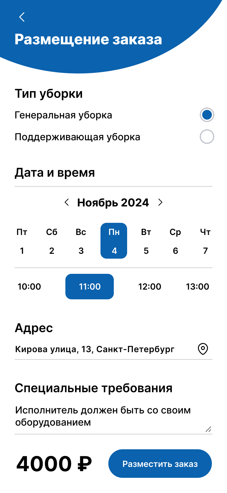

# Cleaning Aggregator

Учебный проект **Агрегатор клининговых услуг** в рамках курса [Kotlin Backend Developer. Professional](https://otus.ru/lessons/kotlin/).

## Описание проекта

Агрегатор клининговых услуг предоставляет заказчикам возможность размещать заявки на уборку, а исполнителям откликаться на эти заявки.

## Визуальное представление фронтенда

Идея визуального представление приложения была взята с [шаблона](https://www.figma.com/community/file/1297074401145789950).

## MVP

В рамках курса планируется реализовать:
1. API сущность [order](./docs/03-architecture/01-api.md) (CRUDS)
2. Аутентификацию через внешний Identity-server 
3. Чтение/запись данных в базу данных

## Документация

1. Маркетинг и аналитика
   1. [Целевая аудитория](./docs/01-business/01-target-audience.md)
   2. [Стейкхолдеры](./docs/01-business/02-stakeholders.md)
   3. [Пользовательские истории](./docs/01-business/03-user-story.md)
2. Аналитика
   1. [Функциональные требования](./docs/02-analysis/01-functional-requirements.md)
   2. [Нефункциональные требования](./docs/02-analysis/02-non-functional-requirements.md)
3. DevOps
   1. [Файлы сборки](./deploy)
4. Архитектура
   1. [Описание API](./docs/03-architecture/01-api.md)
   2. [Схема](./docs/03-architecture/02-arch.md)
